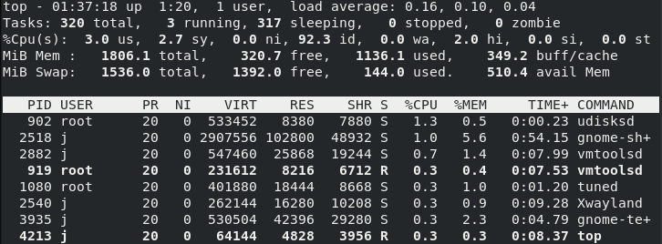

**RPM**

RPM 源代码+安装规定 打包到一起

自动解决依赖关系，降低安装难度

Yum 将大量RPM打包形成仓库

**命令管理方式**

`systemctl restart` 重启服务

`systemctl start` 启动服务

`systemctl stop` 启动服务

`systemctl enable` 加入启动项

`systemctl status` 查看服务状态

|                | 初始化进程       |                    |
| -------------- | ---------------- | ------------------ |
| RHEL 5、RHEL 6 | init             | service            |
| RHEL 7         | systemd 服务名称 | systemctl 配置工具 |

**Bash 解释器 广泛 通用**

命令 参数 对象

-字母

--单词

短格式可以合并

echo = print

date '+%Y-%m-%d %H:%M:%S'

wget 

pwd

ps -aux

R 正在提供服务

S 正在休眠，等待服务

D 出现问题，不能被中断

Z 僵尸进程 不能被中断，一直在消耗资源

T 停止进程

top 命令

Up 运行市场 user 用户数量 

load average 5min 10min 15min

CPU us 已使用 id 空闲率

PID 进程号码

PR 优先级

pidof sshd 服务

ifconfig

网卡名称

